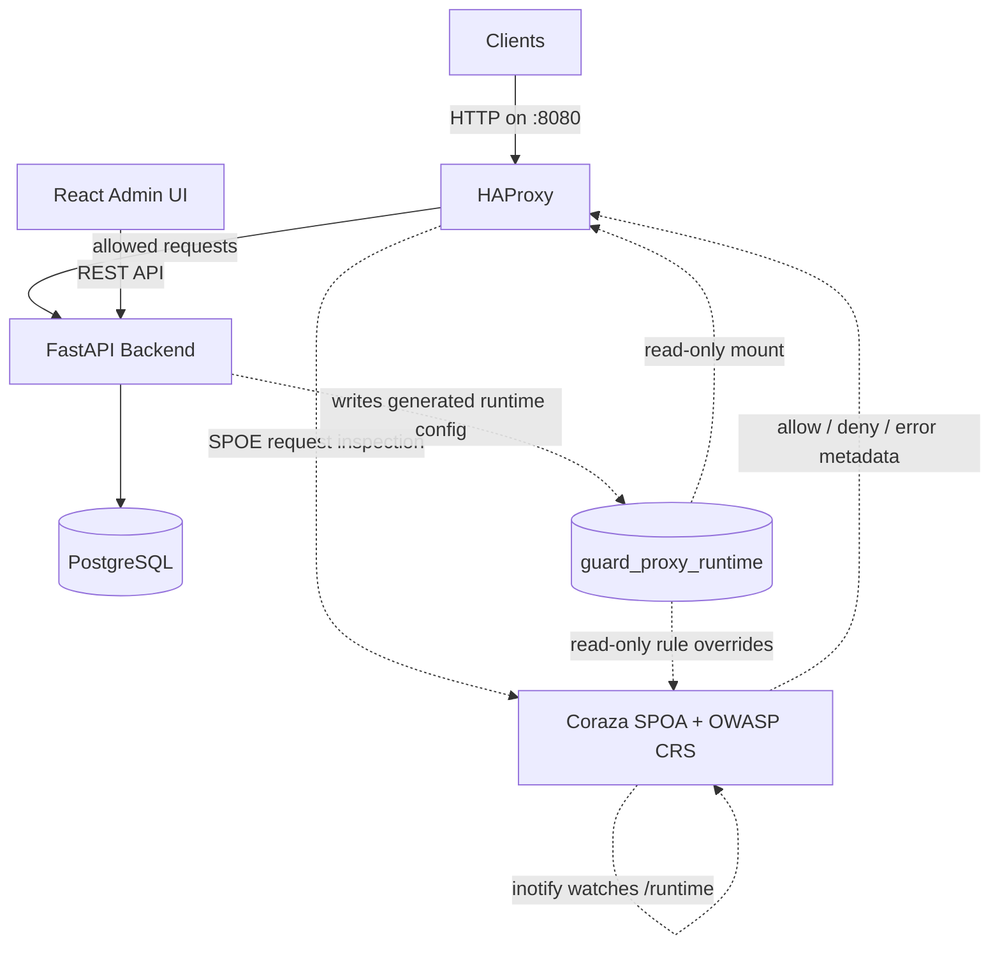
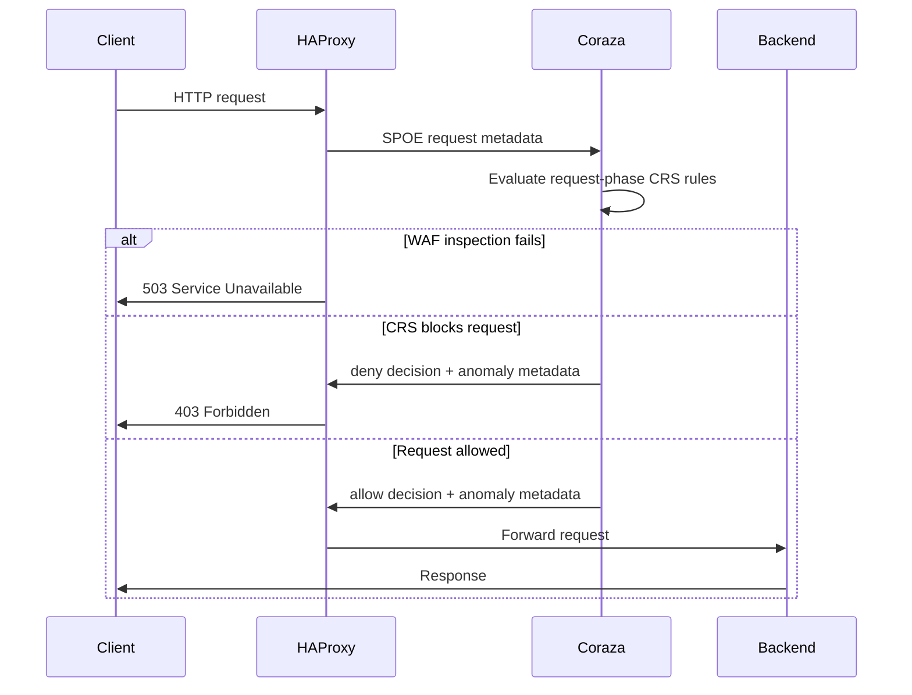

# Architecture - Guard Proxy

## High-Level Overview

Guard Proxy is a self-hosted reverse proxy WAF. The M1 stack runs HAProxy,
Coraza SPOA with OWASP CRS, the FastAPI backend, the React frontend, and
PostgreSQL through Docker Compose.



## Request Flow



M1 focuses on request inspection. HAProxy sends method, path, query,
headers, and body data to Coraza SPOA over SPOE. Coraza evaluates the request
against the configured OWASP CRS bundle and returns transaction variables such
as the action and anomaly score. HAProxy blocks `deny` decisions with `403`.
If SPOE inspection is unavailable or returns an error, HAProxy fails closed
with `503 Service Unavailable`, `X-WAF-Status: degraded`, and a
machine-readable degraded reason header.

## Components

| Component | Role | Location |
|-----------|------|----------|
| **HAProxy** | Reference reverse proxy, host routing, SPOE filter, WAF enforcement, degraded-mode handling | `configs/haproxy/` |
| **Coraza SPOA + OWASP CRS** | Request-phase WAF inspection, CRS anomaly scoring, audit logging seed configuration | `configs/coraza/`, `deploy/docker/coraza.Dockerfile` |
| **FastAPI Backend** | Control-plane API for auth, vhosts, policies, rule overrides, logs, and health checks | `src/backend/` |
| **React Frontend** | Admin panel SPA built with React, TypeScript, Vite, Tailwind CSS, and pnpm | `src/frontend/` |
| **PostgreSQL** | Docker Compose database for backend state | `deploy/docker/docker-compose.yml` |
| **Docker Compose Stack** | Local full-stack orchestration, health checks, networks, logs, and persistent volumes | `deploy/docker/` |

## Data Flow

### Request Processing
1. Client sends an HTTP request to HAProxy.
2. HAProxy rejects unknown hosts with `421` before WAF inspection.
3. HAProxy sends request-phase metadata to Coraza SPOA through SPOE.
4. Coraza evaluates OWASP CRS rules and returns allow/deny metadata.
5. HAProxy returns `403` for denied traffic, `503` for WAF inspection failures (`coraza-unavailable` or `spoe-processing-error`), or forwards allowed requests to the FastAPI backend.

### Policy Management
1. Admin users manage vhosts, policies, and rule overrides through the React UI and FastAPI API.
2. FastAPI persists control-plane state in PostgreSQL.
3. FastAPI writes generated runtime config into the shared
   `guard_proxy_runtime` volume.
4. HAProxy reads the active generated `haproxy.cfg` from the volume and reloads
   through its Runtime API socket when `POST /config/apply` succeeds.
5. Coraza reads the active generated `rule-overrides.conf` from the same volume
   after CRS rules are loaded. The Coraza container runs an inotify supervisor
   that watches the `/runtime` directory; when the backend atomically swaps the
   `current` symlink, the supervisor detects the change and restarts
   `coraza-spoa` automatically — no Docker socket access required.

### Runtime Event Ingestion
1. Runtime WAF events can be represented as structured log payloads.
2. Producers send events to `POST /logs/ingest`.
3. FastAPI validates and normalizes payloads into the persisted log event model.
4. `GET /logs` exposes stored events for the future frontend log viewer.
5. Full automatic Coraza-to-backend event forwarding and production log presentation remain post-M1 work.

## Deployment

### Development (Docker Compose)

The implemented M1 stack lives in `deploy/docker/docker-compose.yml`.

```yaml
services:
  haproxy:   # host port 8080 -> container port 80
  coraza:    # internal port 9000 (SPOE)
  backend:   # internal port 8000 (FastAPI)
  frontend:  # host port 3000 -> Vite port 5173
  postgres:  # internal port 5432
```

Prepare `deploy/docker/.env` from `deploy/docker/.env.example`, then use
`make run` for the normal stack or `make dev` for HAProxy `-d` output and
Coraza debug logging. The end-to-end smoke test is
`benchmarks/smoke/e2e.sh`; it starts the stack, waits for healthy services,
checks a benign request, checks that a SQL injection request is blocked, and
tears the stack down.

### Shared Runtime Volume

Generated runtime artifacts live in the Docker named volume
`guard_proxy_runtime`. The backend mounts it read-write at
`/var/lib/guard-proxy/generated`, HAProxy mounts the same volume at
`/etc/haproxy/generated`, and Coraza mounts it read-only at `/runtime`.

The active release is selected through the `current` symlink:

```text
/runtime/current/
  haproxy.cfg           # generated HAProxy config
  crs-setup.conf        # generated CRS setup snapshot
  rule-overrides.conf   # generated CRS rule removals
```

The backend container starts as root only long enough to create and seed
Coraza's generated rule override include, assign the runtime volume to the
non-root `app` user, and then drops privileges before running migrations and
Uvicorn. HAProxy copies the checked-in reference config into the same seed
release when no generated `haproxy.cfg` exists yet.

The Coraza container image is built on `alpine:3.19` with `tini` as PID 1 and
`inotify-tools` installed. A shell supervisor (`coraza-supervisor.sh`) starts
`coraza-spoa` as a child process and calls `inotifywait` in a loop. When the
backend performs an atomic `os.replace` of the `current` symlink, the supervisor
detects the `moved_to` or `create` event for `current` and restarts
`coraza-spoa` — picking up the new `rule-overrides.conf` without any external
signal or Docker socket access. Note that this is a full process restart, not a
hot-reload: port 9000 is briefly unavailable (~sub-second) during the restart,
causing HAProxy SPOE to return an error for any request that lands in that
window. This is acceptable for a manual rule-apply operation.

## Key Decisions

See `notes/decisions/` for Architecture Decision Records:
- [ADR-001](notes/decisions/ADR-001-fastapi-over-flask-django.md) - FastAPI over Flask/Django
- [ADR-002](notes/decisions/ADR-002-postgresql-with-sqlite-dev.md) - PostgreSQL + SQLite dev
- [ADR-003](notes/decisions/ADR-003-react-typescript-frontend.md) - React + TypeScript
- [ADR-004](notes/decisions/ADR-004-docker-compose-deployment.md) - Docker Compose deployment
- [ADR-006](notes/decisions/ADR-006-sync-sqlalchemy-for-mvp.md) - Synchronous SQLAlchemy for MVP
- [ADR-007](notes/decisions/ADR-007-coraza-spoa-integration.md) - Coraza SPOA integration approach
