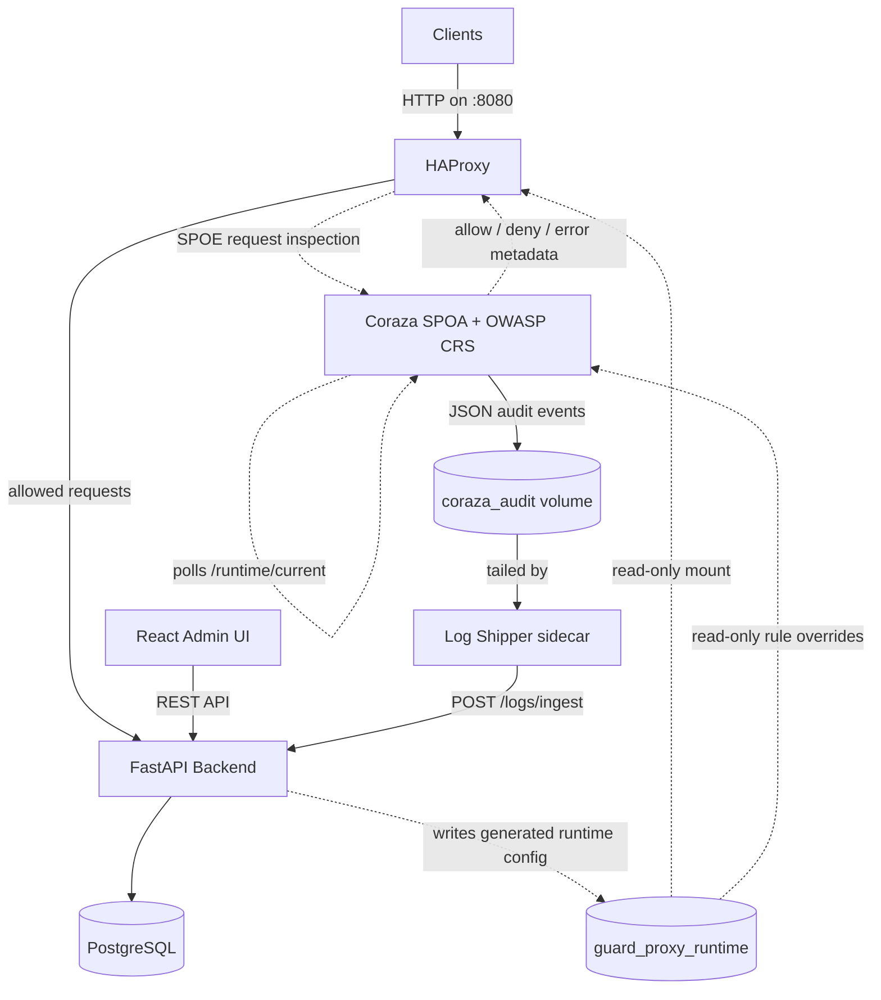
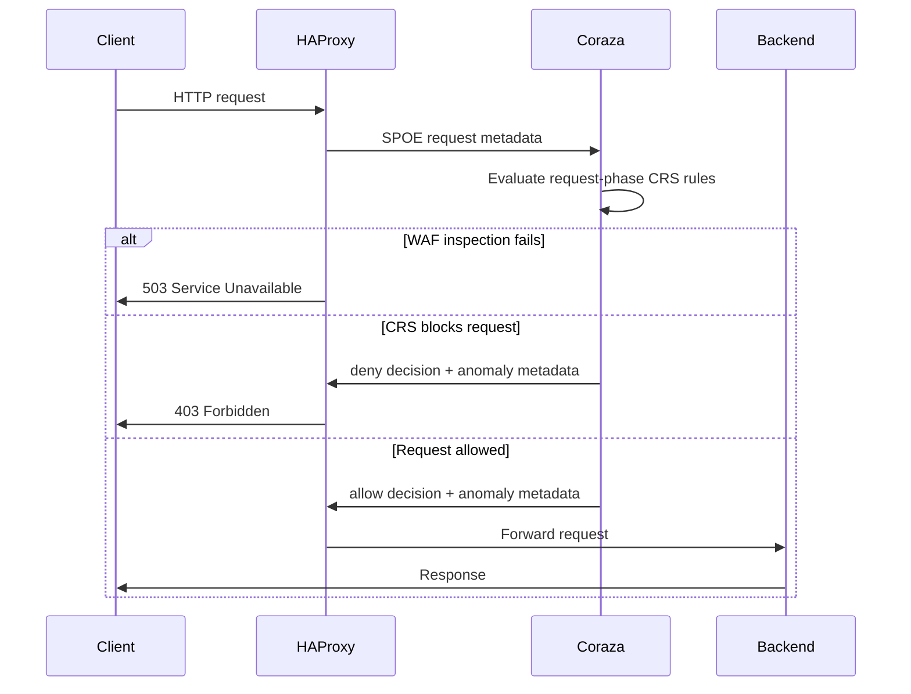

# Architecture - Guard Proxy

## High-Level Overview

Guard Proxy is a self-hosted reverse proxy WAF. The M1 stack runs HAProxy,
Coraza SPOA with OWASP CRS, the FastAPI backend, the React frontend, and
PostgreSQL through Docker Compose.



## Request Flow



M1 focuses on request inspection. HAProxy sends method, path, query,
headers, and body data to Coraza SPOA over SPOE. Coraza evaluates the request
against the configured OWASP CRS bundle and returns transaction variables such
as the action and anomaly score. HAProxy blocks `deny` decisions with `403`.
If SPOE inspection is unavailable or returns an error, HAProxy fails closed
with `503 Service Unavailable`, `X-WAF-Status: degraded`, and a
machine-readable degraded reason header.

## Components

| Component | Role | Location |
|-----------|------|----------|
| **HAProxy** | Reference reverse proxy, host routing, SPOE filter, WAF enforcement, degraded-mode handling | `configs/haproxy/` |
| **Coraza SPOA + OWASP CRS** | Request-phase WAF inspection, CRS anomaly scoring, JSON audit log | `configs/coraza/`, `deploy/docker/coraza.Dockerfile` |
| **Log Shipper sidecar** | Tails Coraza's JSON audit file and ships each event to `POST /logs/ingest` with exponential backoff | `src/log-shipper/` |
| **FastAPI Backend** | Control-plane API for auth, vhosts, policies, rule overrides, logs, and health/readiness probes | `src/backend/` |
| **React Frontend** | Admin panel SPA built with React, TypeScript, Vite, Tailwind CSS, and pnpm | `src/frontend/` |
| **PostgreSQL** | Docker Compose database for backend state | `deploy/docker/docker-compose.yml` |
| **Docker Compose Stack** | Local full-stack orchestration, health checks, networks, logs, and persistent volumes | `deploy/docker/` |

## Data Flow

### Request Processing
1. Client sends an HTTP request to HAProxy.
2. HAProxy rejects unknown hosts with `421` before WAF inspection.
3. HAProxy sends request-phase metadata to Coraza SPOA through SPOE.
4. Coraza evaluates OWASP CRS rules and returns allow/deny metadata.
5. HAProxy returns `403` for denied traffic, `503` for WAF inspection failures (`coraza-unavailable` or `spoe-processing-error`), or forwards allowed requests to the FastAPI backend.

### Policy Management
1. Admin users manage vhosts, policies, and rule overrides through the React UI and FastAPI API.
2. FastAPI persists control-plane state in PostgreSQL.
3. FastAPI writes generated runtime config into the shared
   `guard_proxy_runtime` volume.
4. HAProxy reads the active generated `haproxy.cfg` from the volume and reloads
   through its Runtime API socket when `POST /config/apply` succeeds.
5. Coraza reads the active generated `rule-overrides.conf` from the same volume
   after CRS rules are loaded. The Coraza container runs a supervisor that polls
   the `/runtime/current` symlink; when the backend atomically swaps it, the
   supervisor restarts `coraza-spoa` automatically — no Docker socket access
   required.

### Runtime Event Ingestion
1. Coraza writes one JSON audit event per newline to
   `/var/log/coraza/audit.log` on the `coraza_audit` Docker named volume
   (`SecAuditEngine RelevantOnly` — only transactions where at least one rule
   fired produce an entry).
2. The **log-shipper** sidecar (`src/log-shipper/`) tails the audit file from a
   persisted byte-offset checkpoint. For each complete line it maps the Coraza
   JSON to a `LogIngestRequest` payload (see `configs/coraza/README.md` for the
   field mapping) and `POST`s it to `/logs/ingest` with
   `X-Guard-Proxy-Ingest-Secret`.
3. The offset is only advanced and persisted after a `2xx` response or a
   deliberate skip (parse error or `4xx` rejection). Transient failures
   (`5xx`, network errors, `429`) trigger exponential backoff without advancing
   the offset — so a backend outage stalls the pipeline rather than dropping
   events. The `coraza_audit` file itself is the durable buffer.
4. Idempotency is guaranteed via `producer_event_id` = Coraza
   `transaction.id`; the backend returns `200` for a duplicate rather than
   creating a second row.
5. FastAPI validates and normalizes payloads into the persisted `Log` model.
6. `GET /logs` exposes stored events for the admin panel log viewer.

**Limitation — one log row per request, even when multiple rules fire.** A
single Coraza transaction can trigger several CRS rules at once (e.g. an SQL
injection probe matching `942100`, `942190`, `942270`, and `942360`
simultaneously). The `Log` model has no per-rule child table, so the shipper
picks the **first** rule-bearing message as `rule_id`/`rule_message`
(`_primary_rule_data` in `src/log-shipper/app/mapping.py`); the request still
produces exactly one ingested log row, and `anomaly_score` reflects the
*combined* score from all matched rules, not just the first one. The other
matched rules are not lost — they remain in `raw_context` (the full Coraza
event JSON) for manual inspection in the log detail view, but are not
independently queryable or filterable. See
`src/log-shipper/tests/test_mapping.py::test_multi_rule_request_collapses_to_one_ingest_payload`
and `::test_multi_rule_request_preserves_all_matched_rules_in_raw_context`
for the tested behavior. A per-rule breakdown is deferred post-MVP.

## Authentication & Rate Limiting

The FastAPI backend issues short-lived **JWT access tokens** (30 min, HS256) and
long-lived **refresh tokens** (7 days) stored in an `HttpOnly` cookie. The
refresh cookie path defaults to `/` so it is sent through proxied API prefixes
such as `/api/v1/auth/refresh`, while remaining unavailable to JavaScript. The
frontend keeps no long-lived secret in memory or `localStorage`.

### Brute-force protection

`POST /auth/login` and `POST /auth/refresh` are rate-limited to **5 requests per
minute per client IP** using [slowapi](https://slowapi.readthedocs.io/). Exceeding
the limit returns:

```
HTTP/1.1 429 Too Many Requests
Retry-After: 60
```

The limit is enforced in-process (in-memory via `limits.MemoryStorage`), which is
appropriate for a single-uvicorn-process deployment.

### Client IP resolution

HAProxy sits in front of the backend. The frontend config includes:

```
http-request set-header X-Forwarded-For %[src]
```

This overwrites any client-supplied `X-Forwarded-For` value with the real source
IP before the request reaches the backend, preventing header-spoofing bypass of
the rate limit. The backend's key function reads the first (and only) XFF entry
and falls back to the socket peer when the header is absent (direct connections in
development and test).

### Timing-attack mitigation

The login handler always runs `bcrypt.verify` against a precomputed dummy hash
when the requested email does not exist, keeping response time consistent and
preventing user-enumeration through timing.

## Deployment

### Health and Readiness Probes

The backend exposes two probe endpoints, both unauthenticated:

| Endpoint | Type | Returns | Checks |
|----------|------|---------|--------|
| `GET /health` | Liveness | 200 always | None — proves the process is alive |
| `GET /ready` | Readiness | 200 / 503 | DB connectivity (`SELECT 1`), runtime config volume writable |

`/ready` returns a JSON body with per-check status so operators can tell which dependency is down:

```json
// 200 — all clear
{"status": "ready", "checks": {"database": {"status": "ok"}, "runtime_config": {"status": "ok"}}}

// 503 — one or more dependencies unavailable
{"status": "not ready", "checks": {"database": {"status": "ok"}, "runtime_config": {"status": "error", "detail": "/var/lib/guard-proxy/generated is not a writable directory"}}}
```

The Docker Compose `healthcheck` for the `backend` service targets `/ready`. Almost every other service in the stack (`frontend`, `haproxy`, `coraza`, `log-shipper`) depends on `backend` with `condition: service_healthy`, so `/ready` must pass before dependents start. This prevents dependents from launching while the database is still initialising or the config volume is unavailable.

`/health` is retained as a lightweight liveness probe for orchestrators that separately track process aliveness (e.g. a future Kubernetes `livenessProbe`).

### Development (Docker Compose)

The implemented M1 stack lives in `deploy/docker/docker-compose.yml`.

```yaml
services:
  haproxy:      # host port 8080 -> container port 80
  coraza:       # internal port 9000 (SPOE)
  log-shipper:  # tails coraza_audit volume, ships to backend
  backend:      # internal port 8000 (FastAPI)
  frontend:     # host port 3000 -> Vite port 5173
  postgres:     # internal port 5432
```

Prepare `deploy/docker/.env` from `deploy/docker/.env.example`, then use
`make run` for the normal stack or `make dev` for HAProxy `-d` output and
Coraza debug logging. The end-to-end smoke test is
`benchmarks/smoke/e2e.sh`; it starts the stack, waits for healthy services,
checks a benign request, checks that a SQL injection request is blocked, and
tears the stack down.

### Shared Runtime Volume

Generated runtime artifacts live in the Docker named volume
`guard_proxy_runtime`. The backend mounts it read-write at
`/var/lib/guard-proxy/generated`, HAProxy mounts the same volume at
`/etc/haproxy/generated`, and Coraza mounts it read-only at `/runtime`.

The active release is selected through the `current` symlink:

```text
/runtime/current/
  haproxy.cfg           # generated HAProxy config
  crs-setup.conf        # generated CRS setup snapshot
  rule-overrides.conf   # generated CRS rule removals
```

The backend container starts as root only long enough to create and seed
Coraza's generated rule override include, assign the runtime volume to the
non-root `app` user, and then drops privileges before running migrations and
Uvicorn. HAProxy copies the checked-in reference config into the same seed
release when no generated `haproxy.cfg` exists yet.

The Coraza container image is built on `alpine:3.19` with `tini` as PID 1. A
shell supervisor (`coraza-supervisor.sh`) drops to the non-root `coraza` user,
starts `coraza-spoa` as a child process, and polls `/runtime/current` once per
second. Coraza writes JSON audit events to `/var/log/coraza/audit.log` on the
`coraza_audit` named volume, which is mounted read-only by the log-shipper
sidecar.
The earlier inotify-based supervisor looked simpler, but it did not reliably
observe the backend's atomic `current` symlink replacement through the
read-only runtime volume mount while Coraza kept using the previous loaded
rules. Polling the symlink target is intentionally less clever but directly
tests the state Coraza includes. When the target changes, the supervisor
restarts `coraza-spoa` — picking up the new `rule-overrides.conf` without any
external signal or Docker socket access. If the child process exits, the
supervisor exits non-zero so Compose can restart the container. Note that this
is a full process restart, not a hot-reload: port 9000 is briefly unavailable
(~sub-second) during the restart, causing HAProxy SPOE to return an error for
any request that lands in that window. This is acceptable for a manual
rule-apply operation.

## Key Decisions

See `notes/decisions/` for Architecture Decision Records:
- [ADR-001](notes/decisions/ADR-001-fastapi-over-flask-django.md) - FastAPI over Flask/Django
- [ADR-002](notes/decisions/ADR-002-postgresql-with-sqlite-dev.md) - PostgreSQL + SQLite dev
- [ADR-003](notes/decisions/ADR-003-react-typescript-frontend.md) - React + TypeScript
- [ADR-004](notes/decisions/ADR-004-docker-compose-deployment.md) - Docker Compose deployment
- [ADR-006](notes/decisions/ADR-006-sync-sqlalchemy-for-mvp.md) - Synchronous SQLAlchemy for MVP
- [ADR-007](notes/decisions/ADR-007-coraza-spoa-integration.md) - Coraza SPOA integration approach
- [ADR-008](notes/decisions/ADR-008-log-shipper-sidecar.md) - Log shipper: custom Python sidecar over Vector/Fluent Bit

**M0-08 — Rate limiting (slowapi, in-memory):** The auth endpoints are guarded
by a 5/minute per-IP limit via slowapi with in-memory storage. A Redis-backed
distributed limiter was considered but is not needed for a single-process
deployment; the simpler in-process approach avoids an external dependency.
