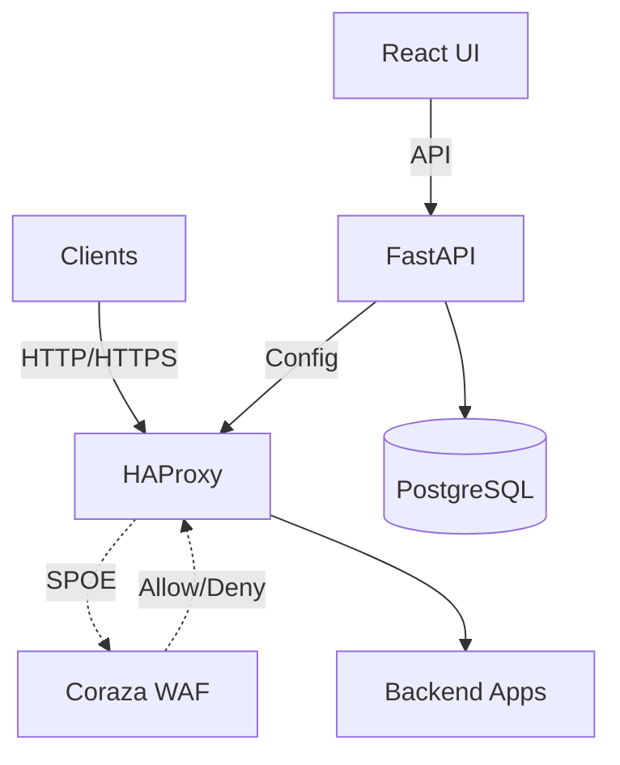
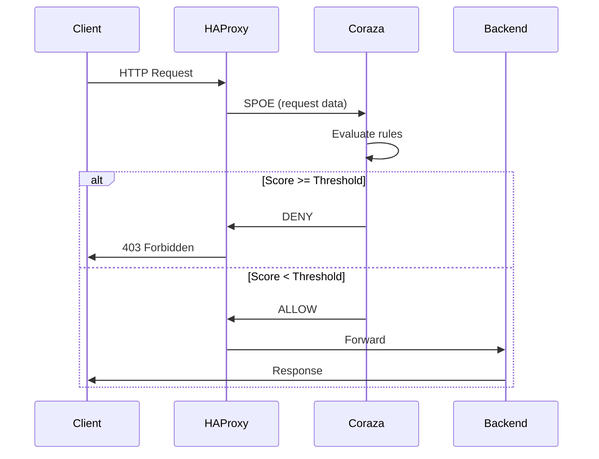

# Architecture - Guard Proxy

## High-Level Overview



## Request Flow



## Components

| Component | Role | Location |
|-----------|------|----------|
| **HAProxy** | Reverse proxy, HTTPS termination, vhost routing, SPOE | `configs/haproxy/` *(planned)* |
| **Coraza SPOA** | WAF engine, OWASP CRS, anomaly scoring, per-vhost rules | *(planned)* |
| **FastAPI Backend** | Policy management API, config generation | `src/backend/` |
| **React Frontend** | Admin panel UI, policy editor, Vite app managed with pnpm | `src/frontend/` *(planned)* |

## Data Flow

### Request Processing
1. Client -> HAProxy
2. HAProxy -> Coraza (SPOE with method, path, query, headers, body)
3. Coraza evaluates CRS rules, calculates anomaly score
4. Coraza -> HAProxy (allow/deny + score)
5. HAProxy -> Backend (if allowed) or 403 (if denied)

### Policy Management
1. Admin edits policy in React UI
2. API call to FastAPI backend
3. Backend updates PostgreSQL
4. Backend generates HAProxy/Coraza config
5. Backend reloads HAProxy (graceful, no dropped connections)

## Deployment

### Development (Docker Compose)
```yaml
services:
  haproxy:    # Port 80, 443
  coraza:     # Port 9000 (SPOE)
  backend:    # Port 8000 (API)
  frontend:   # Port 3000 (pnpm + Vite dev server)
  postgres:   # Port 5432
```


## Key Decisions

See `notes/decisions/` for Architecture Decision Records:
- [ADR-001](notes/decisions/ADR-001-fastapi-over-flask-django.md) - FastAPI over Flask/Django
- [ADR-002](notes/decisions/ADR-002-postgresql-with-sqlite-dev.md) - PostgreSQL + SQLite dev
- [ADR-003](notes/decisions/ADR-003-react-typescript-frontend.md) - React + TypeScript
- [ADR-004](notes/decisions/ADR-004-docker-compose-deployment.md) - Docker Compose deployment
