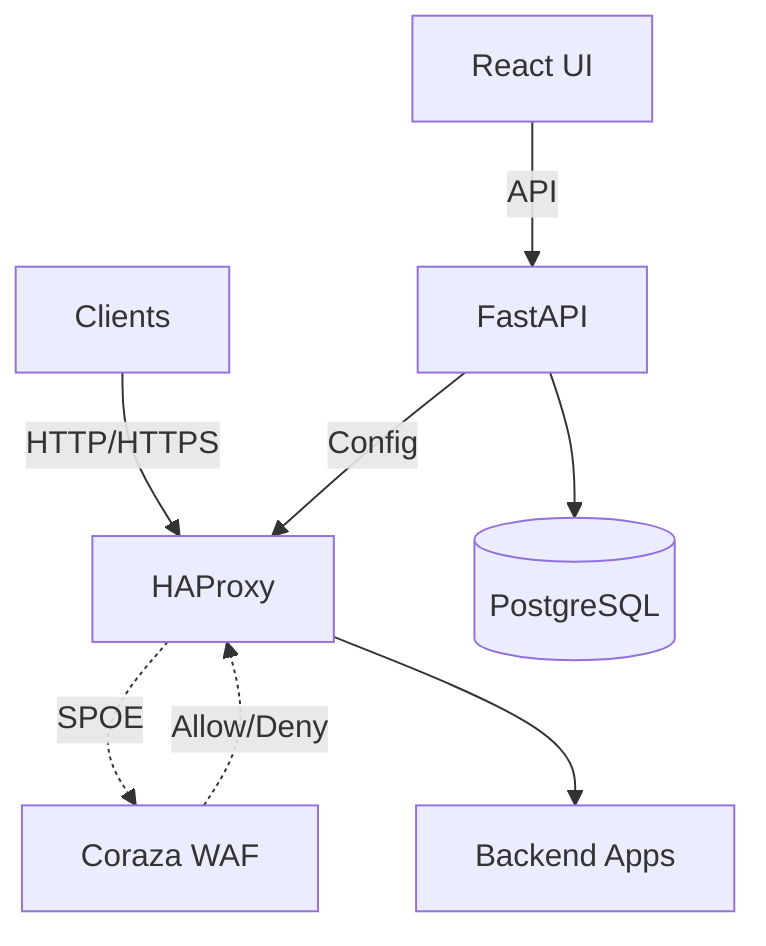

# Guard Proxy

> Self-hosted Reverse Proxy WAF with HAProxy and OWASP Coraza

## About

Guard Proxy is a Web Application Firewall (WAF) solution designed for self-hosted environments. It combines HAProxy as a reverse proxy with Coraza WAF engine and OWASP Core Rule Set for threat detection, managed through a web-based admin panel.

This project is being developed as a master's thesis at Wroclaw University DSW. 

## Implemented M1 Capabilities

- **HAProxy 3.0** reference reverse proxy with SPOE integration
- **Coraza SPOA** with OWASP CRS 4.x for request inspection
- **Fail-closed WAF degraded mode** when Coraza inspection is unavailable
- **FastAPI backend** for auth, vhosts, policies, rule overrides, logs, and health
- **React admin panel** served by the Docker Compose stack
- **Docker Compose full-stack deployment** for local development and smoke testing

## Planned/Post-M1 Capabilities

- Generated HAProxy and Coraza configuration from stored policies
- Policy-driven graceful reload, validation, and rollback
- Richer per-vhost runtime policy wiring
- Complete frontend workflows for policy editing, monitoring, and WAF log review
- Observability with Prometheus, Grafana, and Loki

## Architecture

## Tech Stack

- **Proxy**: HAProxy 3.0 with SPOE
- **WAF**: Coraza SPOA 0.6.1 + OWASP CRS 4.x
- **Backend**: Python 3.13, FastAPI, SQLAlchemy, PostgreSQL
- **Frontend**: React, TypeScript, Vite, Tailwind CSS, pnpm
- **Infrastructure (MVP)**: Docker Compose
- **Observability (Post-MVP / optional)**: Prometheus, Grafana, Loki

## Project Status

**Status**: In development — backend MVP

See [project board](https://github.com/users/bihius/projects/1) for detailed task breakdown.
Or view [milestones](https://github.com/bihius/guard-proxy/milestones)

## Documentation

- [Architecture](README.architecture.md) - System architecture and data flow
- [Development Commands](README.commands.md) - All development commands
- [Testing Strategy](README.testing.md) - Testing approach and targets
- [Course team handoff](docs/course-team-handoff.md) - Setup, task assignments, and PR checklist for course contributors

## Run Full Stack (Docker Compose)

1. Prepare environment file:
   - `cp deploy/docker/.env.example deploy/docker/.env`
   - Update secrets in `deploy/docker/.env`
2. Start the stack:
   - `make run` for normal mode
   - `make dev` for HAProxy and Coraza debug logging
3. Access services:
   - Frontend: `http://localhost:3000`
   - API via HAProxy: `http://localhost:8080`
   - Backend health via HAProxy: `curl http://localhost:8080/health`
4. Optional WAF smoke test:
   - `curl -i -H 'Host: app.local' "http://localhost:8080/?id=1%27%20OR%20%271%27=%271"` should return `403 Forbidden`

Use `make down` to stop containers (keeps named volumes such as Postgres data).

Use `make clean` to stop containers and remove volumes (full local reset).

## License

MIT License - see [LICENSE](LICENSE)
