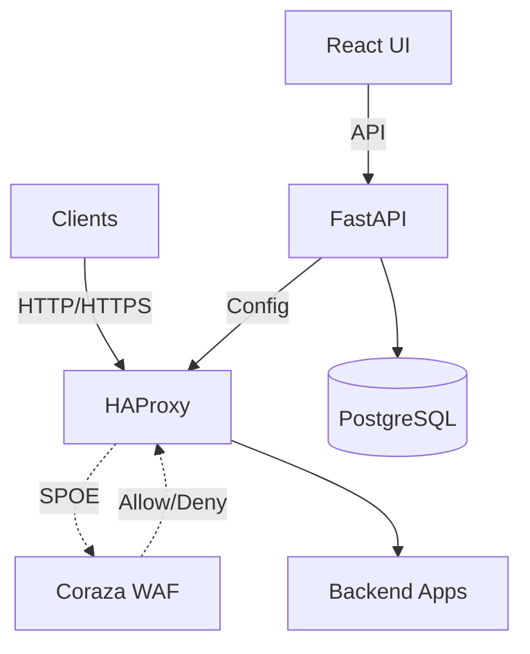

# Guard Proxy

> Self-hosted Reverse Proxy WAF with HAProxy and OWASP Coraza

## About

Guard Proxy is a Web Application Firewall (WAF) solution designed for self-hosted environments. It combines HAProxy as a reverse proxy with Coraza WAF engine and OWASP Core Rule Set for threat detection, managed through a web-based admin panel.

This project is being developed as a master's thesis at Wroclaw University DSW. 

## Planned Features

- **HAProxy 2.8+** as reverse proxy with SPOE integration
- **Coraza WAF 3.x** with OWASP CRS for threat detection
- **Per-vhost policies** with configurable paranoia levels (PL1-PL4)
- **Anomaly scoring** for intelligent threat detection
- **Admin panel** (FastAPI + React) for managing policies and monitoring
- **Docker-based deployment** for easy setup

## Architecture

## Tech Stack

- **Proxy**: HAProxy 2.8+ with SPOE
- **WAF**: Coraza 3.x + OWASP CRS 4.x
- **Backend**: Python 3.13, FastAPI, SQLAlchemy, PostgreSQL
- **Frontend**: React, TypeScript, Vite, Tailwind CSS, pnpm
- **Infrastructure (MVP)**: Docker Compose
- **Observability (Post-MVP / optional)**: Prometheus, Grafana, Loki

## Project Status

**Status**: In development — backend MVP

See [project board](https://github.com/users/bihius/projects/1) for detailed task breakdown.
Or view [milestones](https://github.com/bihius/guard-proxy/milestones)

## Documentation

- [Architecture](README.architecture.md) - System architecture and data flow
- [Development Commands](README.commands.md) - All development commands
- [Testing Strategy](README.testing.md) - Testing approach and targets
- [Course team handoff](docs/course-team-handoff.md) - Setup, task assignments, and PR checklist for course contributors

## Run Full Stack (Docker Compose)

1. Prepare environment file:
   - `cp deploy/docker/.env.example deploy/docker/.env`
   - Update secrets in `deploy/docker/.env`
2. Start the stack:
   - `make dev`
3. Access services:
   - Frontend: `http://localhost:3000`
   - API via HAProxy: `http://localhost:8080`
   - Backend docs: `http://localhost:8080/docs`

Use `make down` to stop containers and remove volumes.

## License

MIT License - see [LICENSE](LICENSE)
