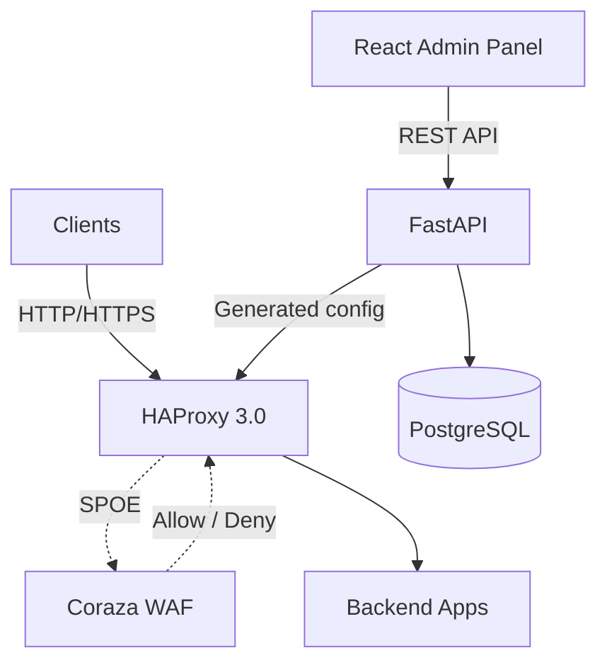

# Guard Proxy

> Self-hosted Web Application Firewall — HAProxy + Coraza + React admin panel

Guard Proxy is a WAF solution built for self-hosted environments. It wires HAProxy 3.0 (reverse proxy) to Coraza WAF (OWASP CRS 4.x) via SPOE, and exposes a FastAPI backend and React admin panel to manage vhosts, policies, rule overrides, and live configuration deployment.

Developed as a master's thesis at Wrocław University DSW.

---

## Architecture



---

## What's Implemented

### Milestone 1 — Vertical slice ✅
- HAProxy 3.0 reverse proxy with SPOE integration
- Coraza SPOA + OWASP CRS 4.x for request inspection
- Fail-closed degraded mode when Coraza is unavailable
- FastAPI backend: auth, vhosts, policies, rule overrides, WAF logs, health
- React admin panel: dashboard, login, vhost management, policy editing
- Docker Compose full-stack deployment

### Milestone 2 — Config generator ✅
- Multi-vhost HAProxy + Coraza config generation from stored policies
- `POST /config/apply` endpoint with atomic swap and automatic rollback
- inotify-based config reload supervisor (no Docker socket dependency)
- Live runtime deployment status card in the dashboard
- Apply-config button in the admin panel

---

## Tech Stack

| Layer | Technology |
|---|---|
| Proxy | HAProxy 3.0 with SPOE |
| WAF | Coraza SPOA 0.6.1 + OWASP CRS 4.x |
| Backend | Python 3.13, FastAPI, SQLAlchemy, PostgreSQL |
| Frontend | React, TypeScript, Vite, Tailwind CSS |
| Package mgmt | uv (Python), pnpm (Node) |
| Infrastructure | Docker Compose |

---

## Roadmap

| Milestone | Scope | Status |
|---|---|---|
| M0 | Cleanup & scaffolding | Done |
| M1 | Vertical slice — full stack end-to-end | Done |
| M2 | Config generator & live apply | Done |
| M3 | WAF log ingestion, presentation, and dashboard evidence | Done |
| M4 | Policy hardening and per-vhost rule tuning | Path B |
| M5 | Panel hardening and DevEx | Done |
| M6 | Thesis evaluation — benchmarks, ZAP, Nuclei, CRS suite, comparison work | Path A active |
| Post-MVP | Product expansion outside the thesis MVP | Deferred |

### Delivery order

The thesis-critical path is:

```text
M3 -> M5 -> M6
```

That path should produce the demo and thesis evidence first: visible WAF logs, runtime/dashboard status, health checks, user/admin basics, benchmark harnesses, effectiveness tests, and false-positive/false-negative analysis.

Path B work can run after that convergence point, or in parallel only when it does not slow the thesis path:

```text
M4 policy depth -> M3/M5 polish -> optional M6 comparisons -> Post-MVP backlog
```

Path B covers richer policy tuning, path-scoped bindings, custom rules, live log streaming, pagination, password-management polish, product analytics, GeoIP/DDoS features, TLS automation, and advanced backend routing.

---

## Quick Start

### Prerequisites

- Docker + Docker Compose
- `make`

### Run

```bash
cp deploy/docker/.env.example deploy/docker/.env
# Edit deploy/docker/.env and set your secrets

make run       # normal mode or
make dev       # HAProxy + Coraza debug logging

make seed      # add the initial admin user
```

### Access

| Service | URL |
|---|---|
| Admin panel | http://localhost:3000 |
| API (via HAProxy) | http://localhost:8080 |
| Liveness probe | `curl http://localhost:8080/health` |
| Readiness probe | `curl http://localhost:8080/ready` |

### WAF smoke test

```bash
curl -i -H 'Host: app.local' \
  "http://localhost:8080/?id=1%27%20OR%20%271%27=%271"
# Expected: 403 Forbidden
```

### Teardown

```bash
make down    # stop containers, keep volumes
make clean   # stop containers and remove all volumes
```

---

## Documentation

- [Architecture](README.architecture.md) — system architecture and data flow
- [Development Commands](README.commands.md) — all dev commands
- [Testing Strategy](README.testing.md) — testing approach and targets
- [Project board](https://github.com/users/bihius/projects/1) — task breakdown
- [Milestones](https://github.com/bihius/guard-proxy/milestones)

---

## License

[MIT](LICENSE)
