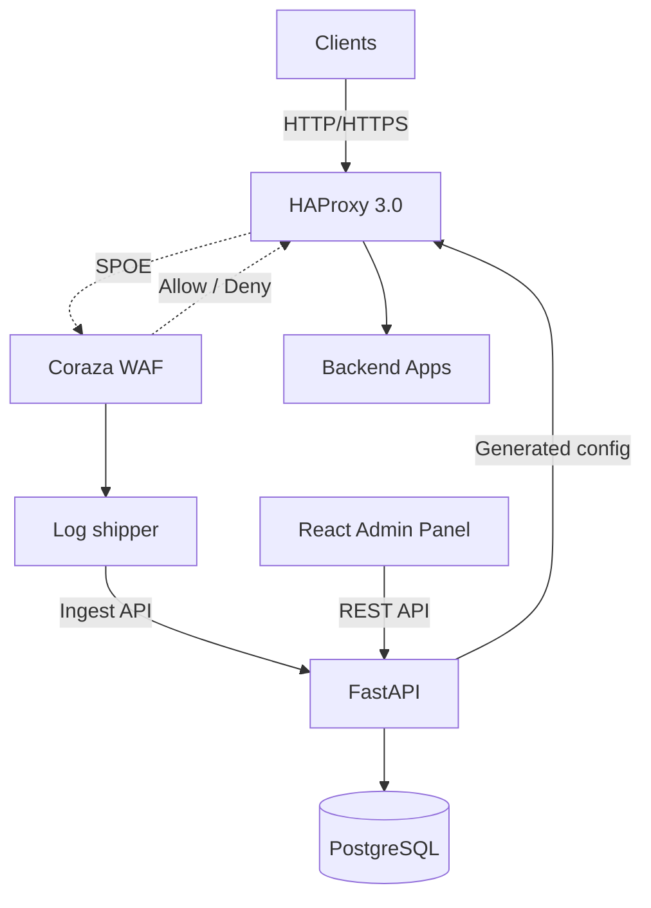

# Guard Proxy

> Self-hosted Web Application Firewall — HAProxy + Coraza + React admin panel

Guard Proxy is a WAF solution built for self-hosted environments. It wires HAProxy 3.0 (reverse proxy) to Coraza WAF (OWASP CRS 4.x) via SPOE, and exposes a FastAPI backend and React admin panel to manage vhosts, policies, rule overrides, and live configuration deployment.

Developed as a master's thesis project at Wrocław University DSW.

---

## Features

- **Reverse proxy + WAF** — HAProxy 3.0 inspects every request through the Coraza SPOA (OWASP CRS 4.x), blocks attacks with 403, and fails closed (503) when the WAF is unavailable.
- **Virtual host management** — register domains and backend targets from the admin panel; unknown hosts are rejected before WAF inspection.
- **Policy management** — paranoia level, anomaly thresholds, enforcement mode (block / detect-only), and per-policy CRS rule overrides.
- **One-click config deployment** — `POST /config/apply` renders HAProxy/Coraza config from the database, validates it, atomically swaps it in, reloads HAProxy, and rolls back on failure. Deployment status is shown live on the dashboard.
- **WAF event logs** — a sidecar log shipper ingests Coraza audit events into PostgreSQL; the panel provides filtering, pagination, and event detail views.
- **Authentication and roles** — JWT-based login with admin/viewer roles and CLI user management.
- **Evaluation lab** — reproducible benchmark environment (Juice Shop, DVWA, WordPress, go-ftw) for measuring WAF effectiveness and overhead.

## Architecture



See [README.architecture.md](README.architecture.md) for the full data flow.

## Tech Stack

| Layer | Technology |
|---|---|
| Proxy | HAProxy 3.0 with SPOE |
| WAF | Coraza SPOA 0.6.1 + OWASP CRS 4.x |
| Backend | Python 3.13, FastAPI, SQLAlchemy, PostgreSQL |
| Frontend | React, TypeScript, Vite, Tailwind CSS |
| Package mgmt | uv (Python), pnpm (Node) |
| Infrastructure | Docker Compose |

---

## Quick Start

### Prerequisites

- Docker + Docker Compose
- `make`

### Run

```bash
cp deploy/docker/.env.example deploy/docker/.env
# Edit deploy/docker/.env and set your secrets

make run       # normal mode or
make dev       # HAProxy + Coraza debug logging

make seed      # add the initial admin user (ADMIN_EMAIL / ADMIN_PASSWORD from .env)
```

Additional accounts are managed with the user CLI, e.g.:

```bash
make users ARGS="create --email alice@example.com --password '<min 12 chars>' --full-name 'Alice'"
make users ARGS="list"
```

See [User Management](README.commands.md#user-management) for all commands.

### Access

| Service | URL |
|---|---|
| Admin panel | http://localhost:3000 |
| API (via HAProxy) | http://localhost:8080 |
| Liveness probe | `curl http://localhost:8080/health` |
| Readiness probe | `curl http://localhost:8080/ready` |

### WAF smoke test

```bash
curl -i -H 'Host: app.local' \
  "http://localhost:8080/?id=1%27%20OR%20%271%27=%271"
# Expected: 403 Forbidden
```

### Teardown

```bash
make down    # stop containers, keep volumes
make clean   # stop containers and remove all volumes
```

---

## Documentation

- [Architecture](README.architecture.md) — system architecture and data flow
- [Development Commands](README.commands.md) — all dev commands, including user management
- [Testing Strategy](README.testing.md) — testing approach and targets
- [Evaluation Plan](docs/evaluation-plan.md) — thesis benchmark methodology and lab scenarios
- [HAProxy configs](configs/haproxy/README.md) — SPOE wiring, degraded mode, troubleshooting
- [Coraza configs](configs/coraza/README.md) — CRS bundle, audit log mapping
- [Frontend](src/frontend/README.md) — admin panel development notes
- [Project board](https://github.com/users/bihius/projects/1) — task breakdown
- [Milestones](https://github.com/bihius/guard-proxy/milestones)

---

## License

[MIT](LICENSE)
