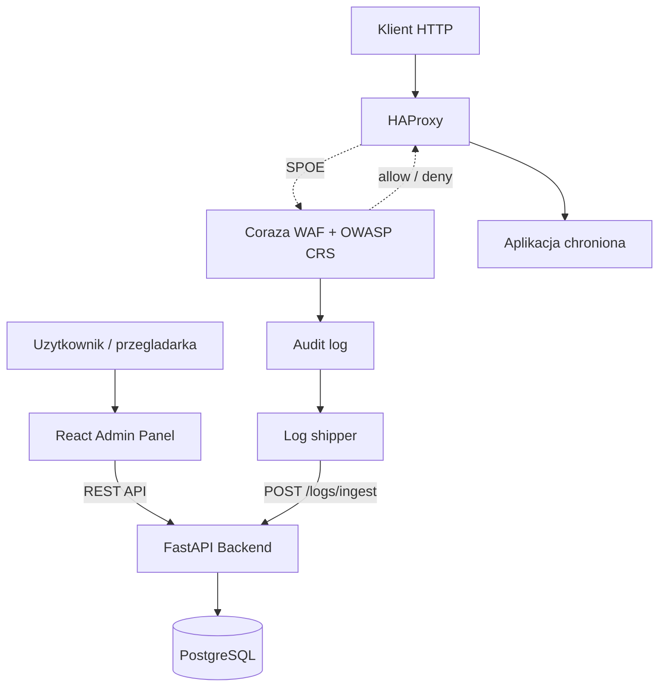

# Dokumentacja projektu kursowego

## 1. Ogolne zalozenia projektu

Guard Proxy to self-hosted Web Application Firewall, czyli system ochrony ruchu
HTTP uruchamiany przed aplikacja webowa. System laczy HAProxy jako reverse proxy,
Coraza WAF z regułami OWASP CRS, backend FastAPI, panel administracyjny React
oraz baze danych.

Glownym celem projektu jest zarzadzanie konfiguracja WAF z poziomu panelu:

- tworzenie i edycja wirtualnych hostow,
- tworzenie i edycja polityk WAF,
- przypisywanie polityk do domen,
- stosowanie wygenerowanej konfiguracji HAProxy/Coraza,
- odbieranie i przegladanie logow zdarzen WAF,
- zabezpieczenie panelu przez logowanie i role uzytkownikow.

## 2. Zastosowane technologie

| Warstwa | Technologie |
| --- | --- |
| Reverse proxy | HAProxy 3.0 |
| WAF | Coraza SPOA, OWASP CRS 4.x |
| Backend | Python 3.13, FastAPI, SQLAlchemy, Alembic |
| Baza centralna | PostgreSQL w Docker Compose |
| Baza lokalna/dev/test | SQLite przez SQLAlchemy |
| Frontend | React, TypeScript, Vite, Tailwind CSS |
| Uwierzytelnianie | JWT access token, HttpOnly refresh token cookie |
| Konteneryzacja | Docker, Docker Compose |
| Testy | pytest, Vitest |

## 3. Architektura systemu



Backend pelni role control plane. Panel React komunikuje sie z nim przez REST API,
a backend zapisuje konfiguracje i dane w PostgreSQL. HAProxy oraz Coraza tworza
warstwe runtime, ktora obsluguje rzeczywisty ruch HTTP. Log shipper przesyla
zdarzenia z Corazy do backendu.

## 4. REST API

API jest udostepnione przez FastAPI. Dokumentacja interaktywna jest dostepna po
uruchomieniu backendu pod adresem:

```text
http://127.0.0.1:8000/docs
```

Najwazniejsze endpointy:

| Metoda | Endpoint | Opis |
| --- | --- | --- |
| GET | `/health` | Health check backendu |
| POST | `/auth/login` | Logowanie uzytkownika |
| POST | `/auth/refresh` | Odnowienie access tokena z refresh cookie |
| POST | `/auth/logout` | Wylogowanie |
| GET | `/auth/me` | Dane aktualnie zalogowanego uzytkownika |
| GET | `/vhosts` | Lista wirtualnych hostow |
| POST | `/vhosts` | Utworzenie wirtualnego hosta |
| GET | `/vhosts/{id}` | Szczegoly wirtualnego hosta |
| PATCH | `/vhosts/{id}` | Edycja wirtualnego hosta |
| DELETE | `/vhosts/{id}` | Usuniecie wirtualnego hosta |
| GET | `/policies` | Lista polityk WAF |
| POST | `/policies` | Utworzenie polityki WAF |
| GET | `/policies/{id}` | Szczegoly polityki WAF |
| PATCH | `/policies/{id}` | Edycja polityki WAF |
| DELETE | `/policies/{id}` | Usuniecie polityki WAF |
| GET | `/policies/{policy_id}/rules` | Lista override'ow reguł CRS |
| POST | `/policies/{policy_id}/rules` | Dodanie override'u reguly CRS |
| PATCH | `/policies/{policy_id}/rules/{id}` | Edycja override'u reguly CRS |
| DELETE | `/policies/{policy_id}/rules/{id}` | Usuniecie override'u reguly CRS |
| GET | `/logs` | Lista logow WAF z filtrami i paginacja |
| POST | `/logs/ingest` | Przyjmowanie logow z log shippera |
| POST | `/config/apply` | Wygenerowanie i zastosowanie konfiguracji runtime |
| GET | `/runtime/status` | Status ostatnich operacji runtime |

### Przykladowe zapytania

Logowanie:

```http
POST /auth/login
Content-Type: application/json

{
  "email": "admin@example.com",
  "password": "TwojeHaslo12345"
}
```

Przykladowa odpowiedz:

```json
{
  "access_token": "jwt-token",
  "token_type": "bearer"
}
```

Utworzenie wirtualnego hosta:

```http
POST /vhosts
Authorization: Bearer jwt-token
Content-Type: application/json

{
  "domain": "app.local",
  "backend_url": "http://demo-app:8080",
  "description": "Aplikacja demonstracyjna",
  "ssl_enabled": false,
  "is_active": true,
  "policy_id": 1
}
```

Utworzenie polityki WAF:

```http
POST /policies
Authorization: Bearer jwt-token
Content-Type: application/json

{
  "name": "Default CRS",
  "description": "Domyslna polityka OWASP CRS",
  "paranoia_level": 1,
  "inbound_anomaly_threshold": 5,
  "outbound_anomaly_threshold": 4,
  "enforcement_mode": "block"
}
```

Pobranie logow:

```http
GET /logs?page=1&page_size=50&action=deny
Authorization: Bearer jwt-token
```

## 5. Schemat bazy danych

Najwazniejsze tabele:

| Tabela | Przeznaczenie |
| --- | --- |
| `users` | Konta uzytkownikow panelu, role i status aktywnosci |
| `vhosts` | Domeny obslugiwane przez HAProxy i ich backendy |
| `policies` | Polityki WAF: poziom paranoi, progi anomalii, tryb pracy |
| `rule_overrides` | Wlaczenia/wylaczenia konkretnych reguł OWASP CRS dla polityki |
| `logs` | Zdarzenia WAF/proxy odebrane przez log shippera |
| `runtime_operations` | Historia operacji zastosowania konfiguracji runtime |

Glowne relacje:

- `vhosts.policy_id` wskazuje na `policies.id`.
- `rule_overrides.policy_id` wskazuje na `policies.id`.
- `vhosts.created_by` i `policies.created_by` wskazuja na `users.id`.
- `logs.vhost_id` i `logs.policy_id` moga wskazywac na powiazany vhost i polityke.

Migracje bazy sa zarzadzane przez Alembic. W Docker Compose system uzywa
PostgreSQL. W trybie lokalnym i testowym mozliwe jest uzycie SQLite, bo warstwa
dostepu do danych jest oparta na SQLAlchemy.

## 6. Operacje CRUD

Projekt spelnia podstawowe wymagania CRUD na centralnej bazie danych:

- `vhosts`: create, read, update, delete,
- `policies`: create, read, update, delete,
- `rule_overrides`: create, read, update, delete,
- `logs`: ingest oraz read z filtrami.

Operacje modyfikujace sa dostepne tylko dla uzytkownikow z rola `admin`.
Uzytkownik `viewer` moze odczytywac dane, ale nie moze ich zmieniac.

## 7. Uwierzytelnianie i bezpieczenstwo

Panel administracyjny wymaga logowania. Backend stosuje:

- hashowanie hasel,
- JWT access token do autoryzacji zapytan API,
- refresh token przechowywany w HttpOnly cookie,
- role `admin` i `viewer`,
- zabezpieczenie endpointow przez zaleznosci FastAPI,
- celowo ogolny komunikat bledu logowania, aby ograniczyc enumeracje kont.

Endpoint `/logs/ingest` jest dodatkowo chroniony wspoldzielonym sekretem w
naglowku `X-Guard-Proxy-Ingest-Secret`, poniewaz korzysta z niego wewnetrzny
log shipper, a nie uzytkownik panelu.

## 8. Obsluga bledow

Backend zwraca standardowe kody HTTP, m.in.:

- `401 Unauthorized` przy braku lub blednym tokenie,
- `403 Forbidden` przy braku wymaganej roli,
- `404 Not Found` gdy zasob nie istnieje,
- `409 Conflict` przy konflikcie unikalnosci,
- `422 Unprocessable Entity` przy blednych danych wejsciowych,
- `500 Internal Server Error` przy bledach runtime/config apply.

Frontend ma wspolny klient API, ktory rozpoznaje bledy odpowiedzi i pozwala
wyswietlic komunikat w interfejsie. Widoki korzystaja ze stanow ladowania,
bledu i pustej listy.

## 9. Frontend

Panel administracyjny jest aplikacja webowa React. Aktualnie obejmuje:

- ekran logowania,
- ochrone tras wymagajacych zalogowania,
- dashboard z informacja o roli i stanie runtime,
- zarzadzanie wirtualnymi hostami,
- formularze tworzenia, edycji i usuwania vhostow,
- przycisk zastosowania konfiguracji,
- wspolne komponenty UI: tabele, status badges, modale, stany ladowania i bledow.

Aplikacja jest responsywna i korzysta z backendowego REST API przez `fetch`.

## 10. Uruchomienie projektu

Przygotowanie konfiguracji:

```bash
cp deploy/docker/.env.example deploy/docker/.env
```

Uruchomienie pelnego stacka:

```bash
make run
```

Uruchomienie trybu debug:

```bash
make dev
```

Utworzenie konta administratora:

```bash
make seed
```

Najwazniejsze adresy:

| Usluga | Adres |
| --- | --- |
| Panel administracyjny | `http://localhost:3000` |
| API przez HAProxy | `http://localhost:8080` |
| Backend lokalny bez proxy | `http://127.0.0.1:8000` |
| Swagger UI | `http://127.0.0.1:8000/docs` |

## 11. Demo

Projekt zawiera osobny katalog demo w `deploy/demo`. Demo uruchamia Guard Proxy
razem z dwiema prostymi aplikacjami HTTP echo za WAF-em. Pozwala to pokazac:

- logowanie do panelu,
- utworzenie polityki WAF,
- utworzenie dwoch vhostow kierujacych na dwie rozne aplikacje demo,
- routing po naglowku `Host` (`app.local` oraz `api.local`),
- zastosowanie konfiguracji,
- poprawne przepuszczenie zwyklego ruchu HTTP,
- dzialanie HAProxy, Coraza i backendu jako jednego systemu.

## 12. Testy

Backend ma testy jednostkowe i integracyjne w `src/backend/tests`. Frontend ma
testy komponentow i klienta API w `src/frontend/src`. Dodatkowo istnieje smoke
test end-to-end dla stacka Docker Compose.

Przykladowe komendy:

```bash
cd src/backend
uv run pytest
```

```bash
cd src/frontend
pnpm run test
pnpm run type-check
pnpm run lint
```

## 13. Screenshoty

Do uzupelnienia przed oddaniem projektu:

- ekran logowania,
- dashboard,
- lista vhostow,
- formularz tworzenia vhosta,
- lista polityk lub szczegoly polityki,
- wynik requestu przepuszczonego przez WAF,
- wynik requestu zablokowanego przez WAF,
- Swagger UI z endpointami API.
