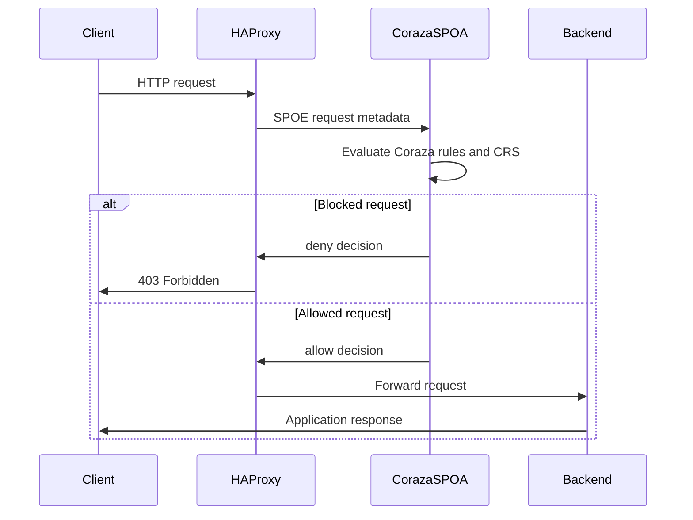

# ADR-007: Coraza SPOA Integration Approach

## Context
Guard Proxy uses HAProxy as the reverse proxy and Coraza as the WAF engine. HAProxy integrates with external WAF logic through SPOE/SPOA: HAProxy sends request metadata to an agent, the agent evaluates the transaction, and HAProxy enforces the returned decision.

The architecture already names Coraza SPOA as the WAF component, and the current Docker Compose scaffold includes a `coraza` service using `ghcr.io/corazawaf/coraza-spoa:0.6.1`. However, no decision has been recorded on whether the project should use the upstream `coraza-spoa` binary or write a custom SPOA adapter.

This decision blocks the M1 WAF path:
- #105 needs a reference HAProxy configuration with SPOE wiring
- #106 needs a Coraza SPOA and OWASP CRS bundle
- #107 needs the full Docker Compose stack to run HAProxy and Coraza together
- #108 needs an end-to-end smoke test where benign traffic is allowed and SQL injection traffic is blocked

## Decision
Use the upstream **`coraza-spoa` Go binary as a sidecar service** for M1/MVP.

HAProxy will communicate with `coraza-spoa` over the internal Docker network using SPOE. Coraza will load local configuration and OWASP CRS files mounted into the container. The backend will not implement SPOE directly during M1; it may later generate Coraza and HAProxy configuration files that the sidecar consumes.

## Rationale

1. **Lowest protocol risk** -- SPOE frame handling is specialized and easy to get subtly wrong. Using the upstream SPOA keeps protocol implementation outside the thesis-critical path.
2. **Matches the current deployment shape** -- The compose stack already models Coraza as a separate `coraza` service. Keeping that shape lets #105-#108 build incrementally on the merged containerization work.
3. **Focuses M1 on WAF behavior** -- The immediate milestone is to show HAProxy consulting Coraza and blocking a known malicious request. Reusing the upstream adapter lets the project spend effort on HAProxy SPOE config, CRS loading, and smoke tests.
4. **Preserves a future custom path** -- A custom SPOA can still be introduced later if upstream behavior blocks required policy, logging, or thesis demonstration features.

## Alternatives Considered

### Alternative 1: Write a custom thin SPOA in Go
- **Pros**: Full control over message schema, logging, per-vhost policy routing, and backend event ingestion
- **Cons**: Requires implementing and testing SPOE protocol handling, concurrency behavior, Coraza transaction lifecycle, body buffering, and failure semantics
- **Rejected because**: The implementation risk is too high for M1. It would delay the vertical slice without being required to prove the WAF path works.

### Alternative 2: Embed WAF logic in the FastAPI backend or a Python sidecar
- **Pros**: Reuses the existing backend language and could simplify event ingestion
- **Cons**: Mismatches Coraza's Go ecosystem, adds latency and operational coupling to the control-plane backend, and still requires a SPOE-speaking adapter
- **Rejected because**: The backend should remain the policy/control-plane service. Request-path WAF evaluation belongs beside HAProxy as a dedicated runtime component.

### Alternative 3: Use upstream `coraza-spoa` as a sidecar
- **Pros**: Uses an existing Coraza integration point, reduces custom protocol work, fits Docker Compose service boundaries, and can be pinned/versioned
- **Cons**: Less control over internal message handling and extension points than a custom adapter
- **Accepted because**: It provides the fastest reliable path to the M1 vertical slice while keeping future customization possible.

## Consequences

### Positive
- M1 can focus on observable WAF behavior rather than adapter internals
- HAProxy and Coraza stay independently deployable services
- Docker Compose remains the main local integration environment
- The project can pin and upgrade `coraza-spoa` as a normal runtime dependency

### Negative
- Custom logging and per-vhost policy behavior may be constrained by upstream `coraza-spoa` capabilities
- Debugging may require understanding upstream adapter behavior and logs
- If a required extension point is missing, a future custom SPOA may still be needed

### Neutral
- Backend-generated config remains compatible with either upstream or custom SPOA as long as file paths and reload behavior are kept explicit
- Response-phase inspection is not part of the initial M1 decision; M1 focuses on request inspection and blocking

## Implementation Implications

- Pin the Coraza SPOA image or binary version in Docker Compose.
- Mount Coraza configuration and CRS rules into the `coraza` container.
- Add HAProxy SPOE configuration that sends request data to the `coraza` service over the internal network.
- Define failure behavior explicitly in HAProxy configuration, including degraded mode follow-up work.
- Keep backend event ingestion separate from this decision; event forwarding can be added once the request blocking path is proven.

## When To Revisit
Reopen this decision if one or more of the following happen:
- Upstream `coraza-spoa` cannot expose the WAF decision or metadata needed by HAProxy for M1
- Per-vhost policies require runtime behavior that cannot be expressed with upstream configuration
- Event ingestion requires structured data that upstream `coraza-spoa` cannot emit or forward
- Performance testing shows the upstream sidecar is the bottleneck

## Validation
This decision is correct if:
- HAProxy can call `coraza-spoa` over SPOE from Docker Compose
- OWASP CRS rules load successfully in Coraza
- A benign request reaches the backend through HAProxy
- A known SQL injection payload is blocked with HTTP 403
- The stack remains reproducible with one Docker Compose workflow

## References
- [Issue #104: ADR-007 Coraza SPOA integration approach](https://github.com/bihius/guard-proxy/issues/104)
- [Issue #105: Hand-written reference haproxy.cfg with SPOE](https://github.com/bihius/guard-proxy/issues/105)
- [Issue #106: Coraza SPOA and OWASP CRS 4.x bundle](https://github.com/bihius/guard-proxy/issues/106)
- [Issue #107: Full-stack docker-compose with HAProxy and Coraza](https://github.com/bihius/guard-proxy/issues/107)
- [Issue #108: End-to-end smoke test](https://github.com/bihius/guard-proxy/issues/108)
- [Coraza SPOA repository](https://github.com/corazawaf/coraza-spoa)
- [Coraza internals documentation](https://coraza.io/docs/reference/internals)
